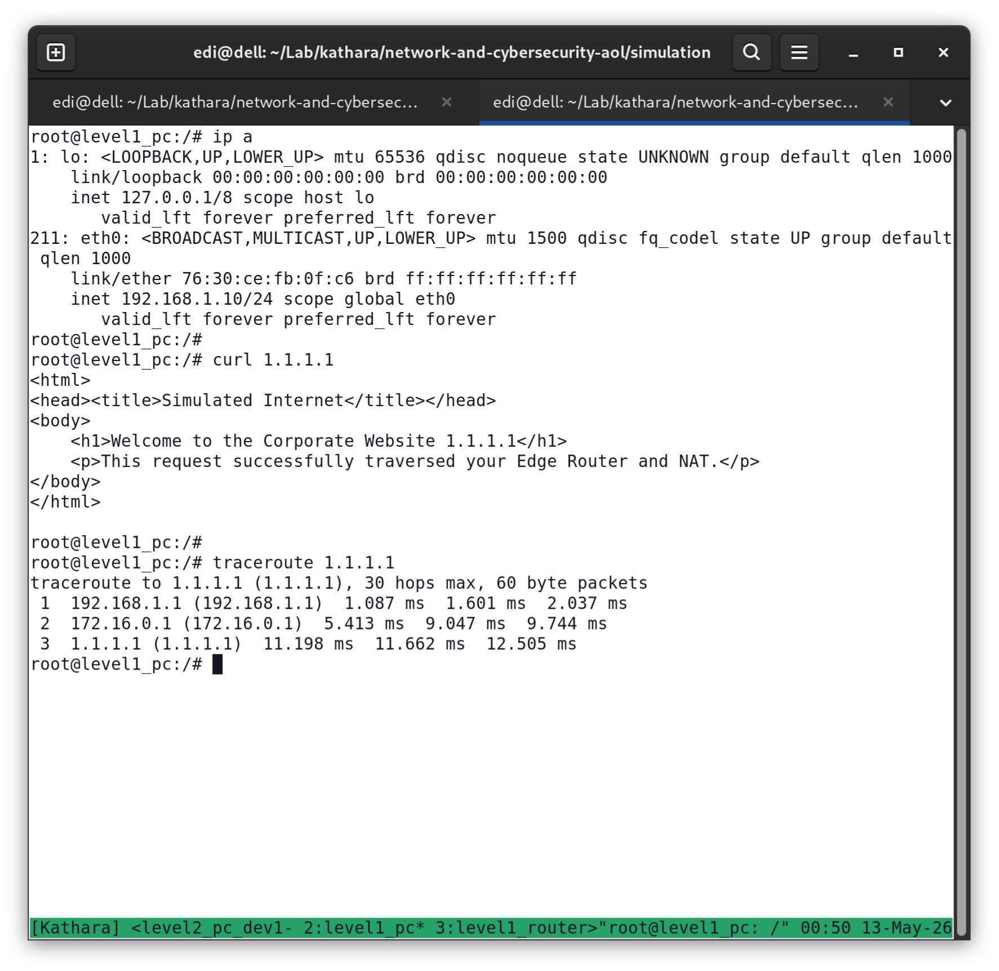
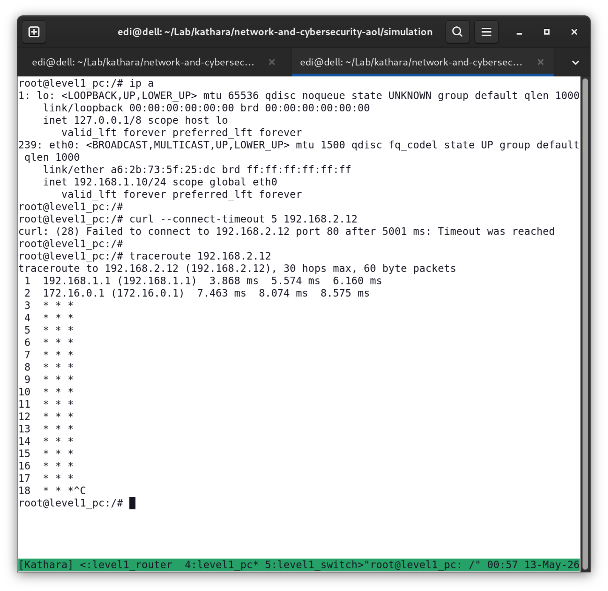
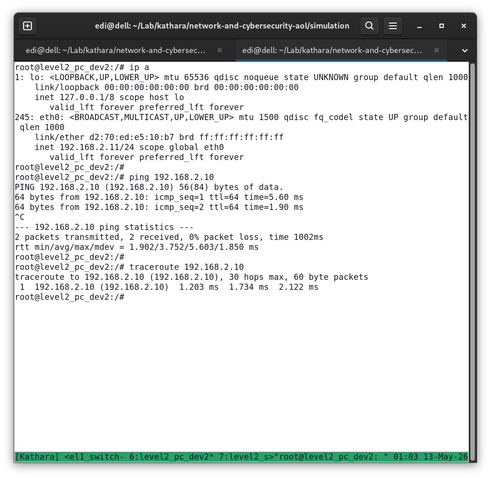
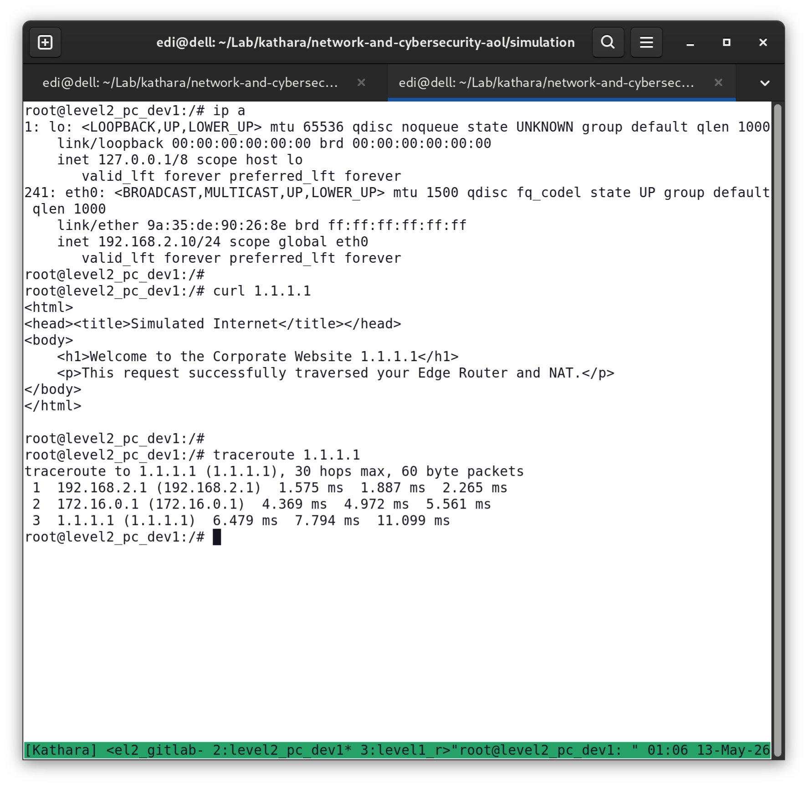
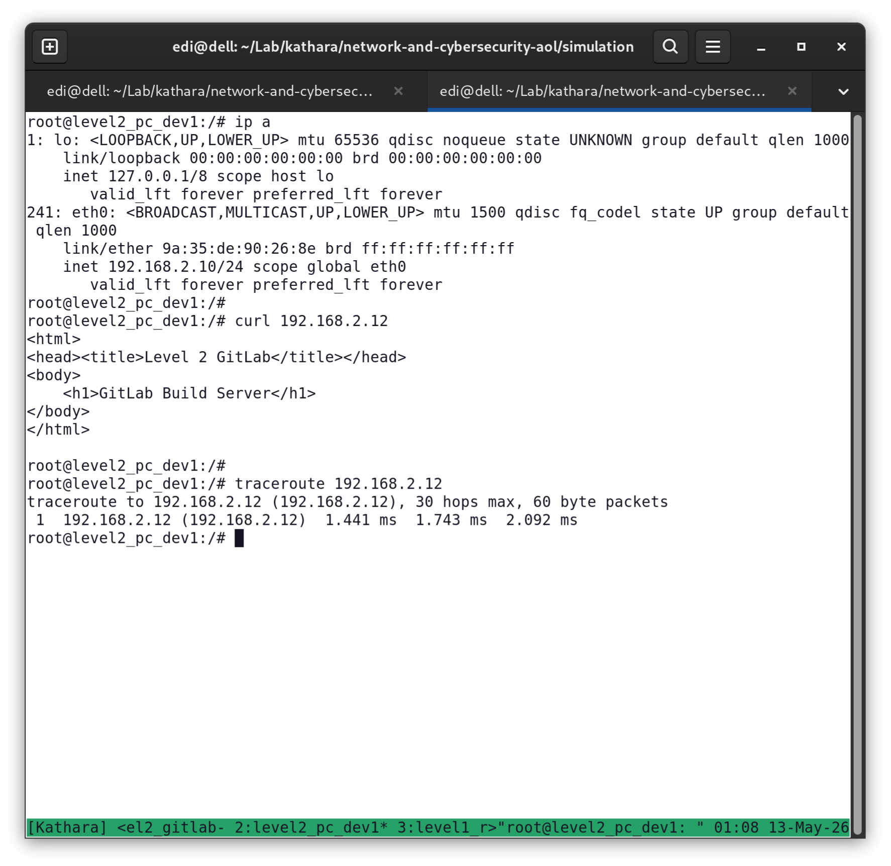
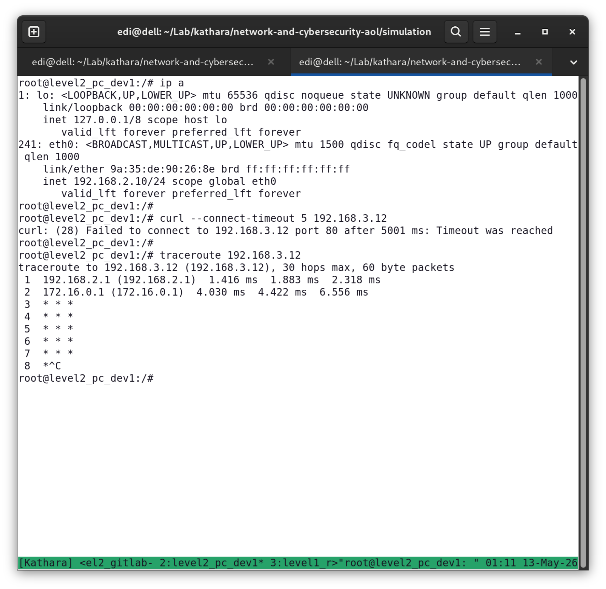
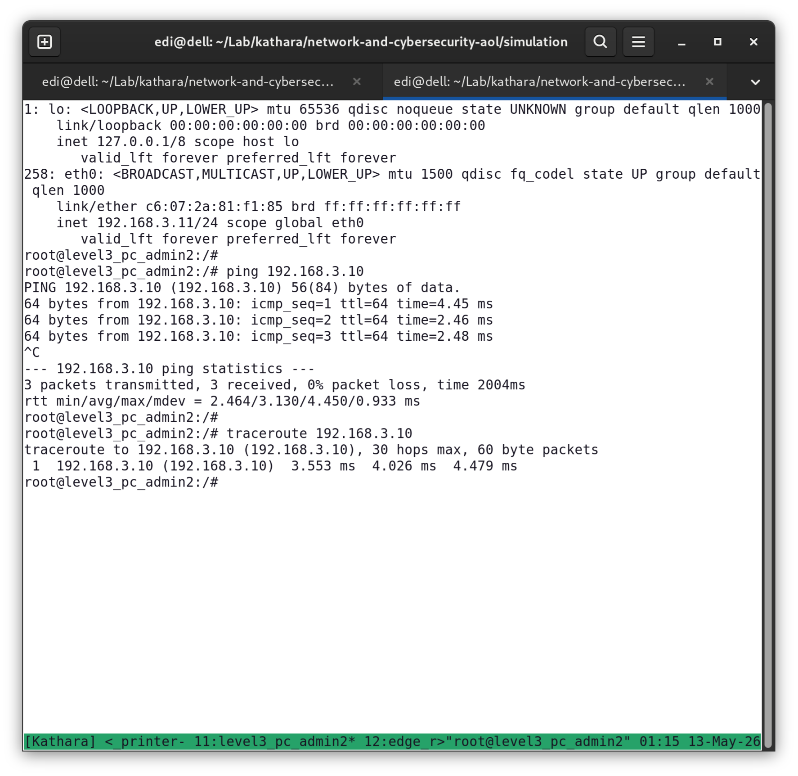
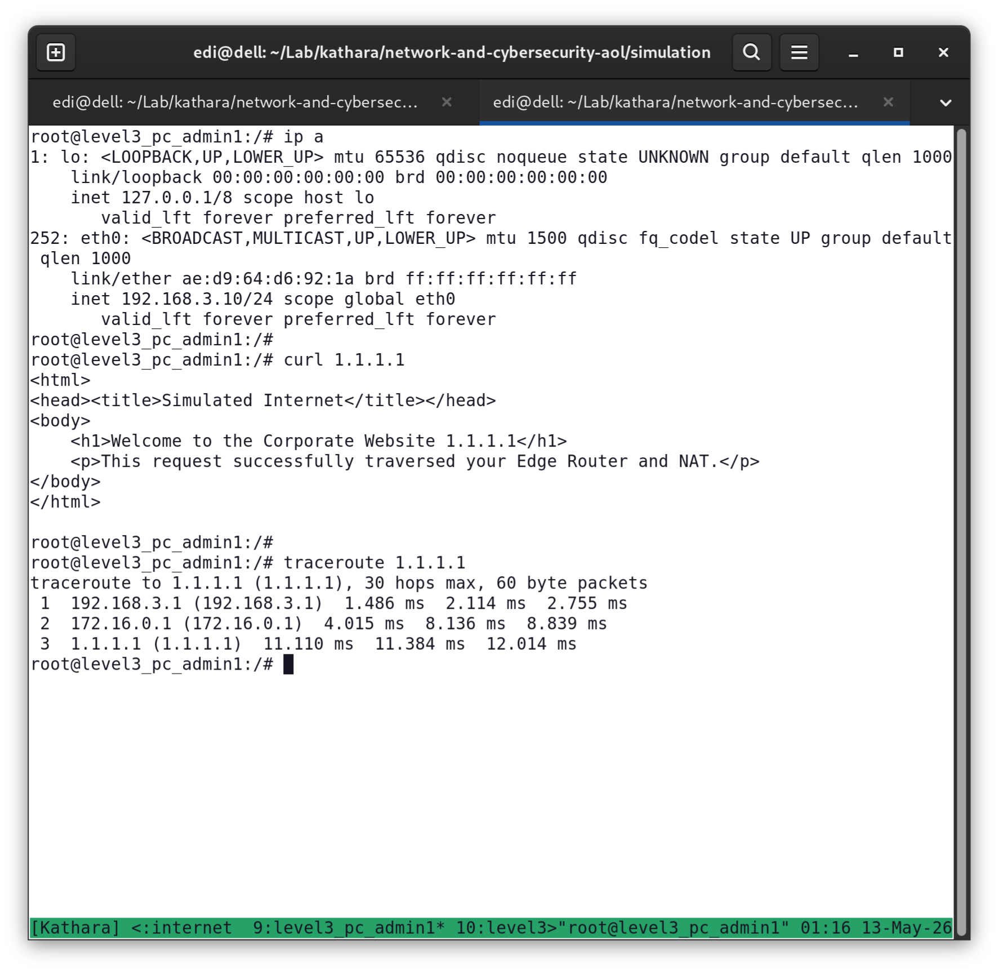
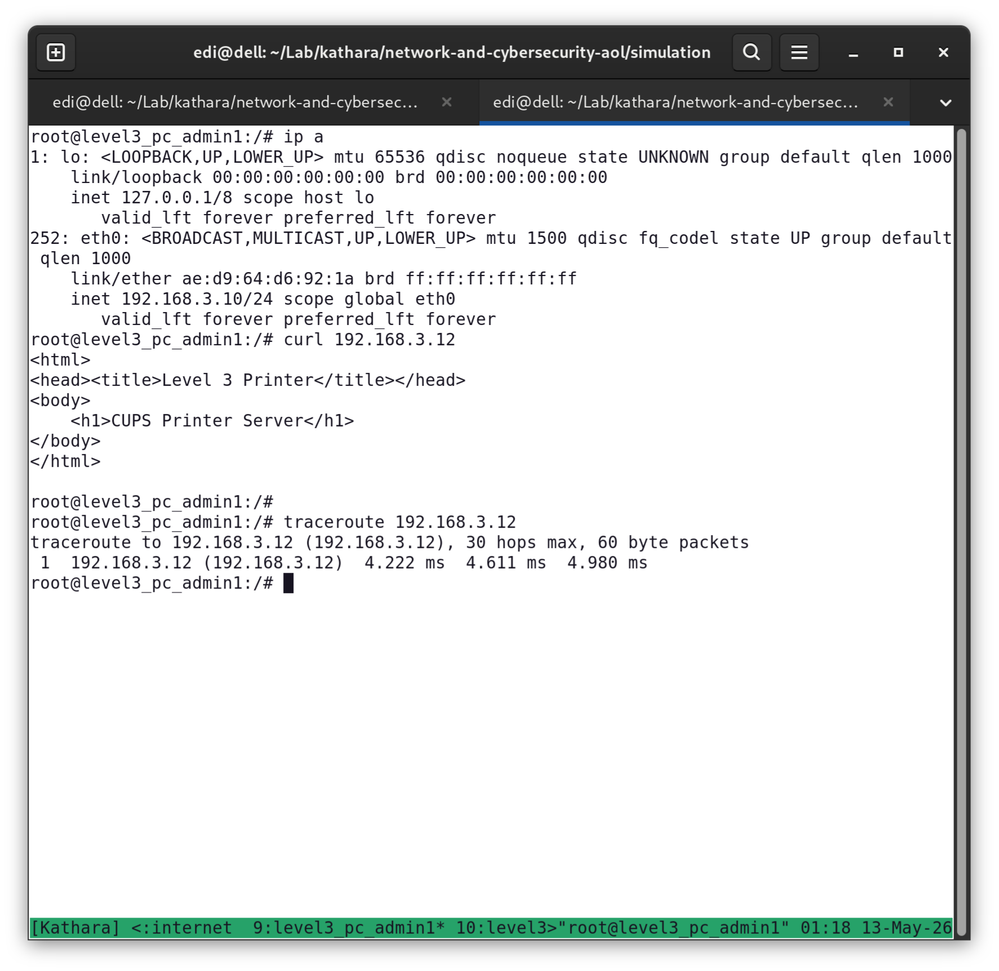
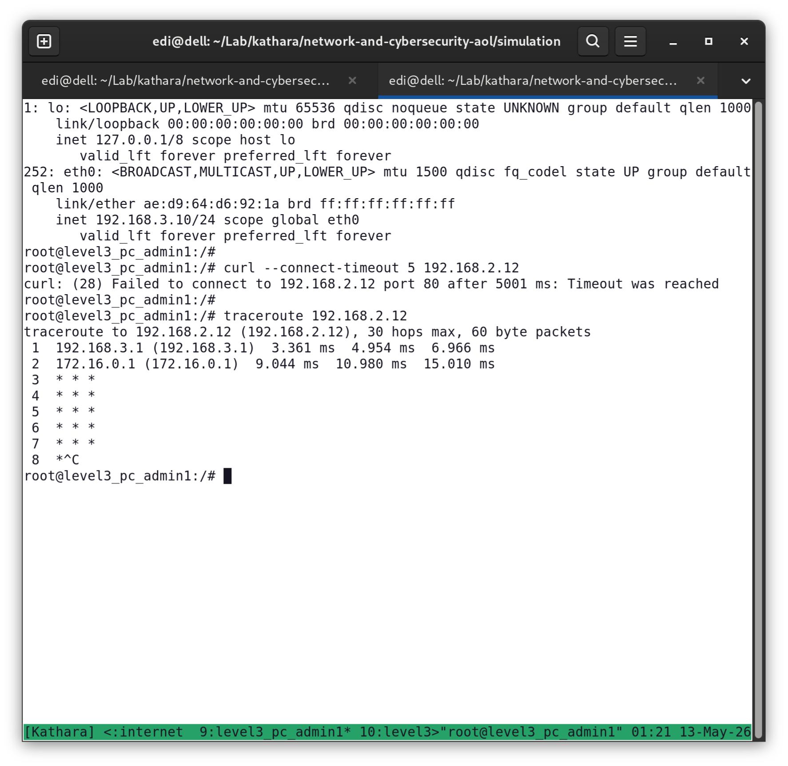

# Documentation

## Topology

### Hosts

| Level | Name         | IP           | Network        | Gateway     |
|-------|--------------|--------------|----------------|-------------|
| 1     | Shop PC      | 192.168.1.10 | 192.168.1.1/24 | 192.168.1.1 |
| 2     | Dev 1        | 192.168.2.10 | 192.168.2.1/24 | 192.168.2.1 |
| 2     | Dev 2        | 192.168.2.11 | 192.168.2.1/24 | 192.168.2.1 |
| 2     | Build Server | 192.168.2.12 | 192.168.2.1/24 | 192.168.2.1 |
| 3     | Admin 1      | 192.168.3.10 | 192.168.3.1/24 | 192.168.3.1 |
| 3     | Admin 2      | 192.168.3.11 | 192.168.3.1/24 | 192.168.3.1 |
| 3     | Printer      | 192.168.3.12 | 192.168.3.1/24 | 192.168.3.1 |

## Security

- Floor isolation (No cross talk between floors)
- Each host can access internet (port 80/443 only)
- Block port scanning

## Proof of Concept

### Level 1 PC Can Access Internet

### Level 1 PC Cannot Access Gitlab

### Level 2 PC Can Cross Talk

### Level 2 PC Can Access Internet

### Level 2 PC Can Access Gitlab

### Level 2 PC Cannot Access Printer

### Level 3 PC Can Cross Talk

### Level 3 PC Can Access Internet

### Level 3 PC Can Access Printer

### Level 3 PC Cannot Access Gitlab

